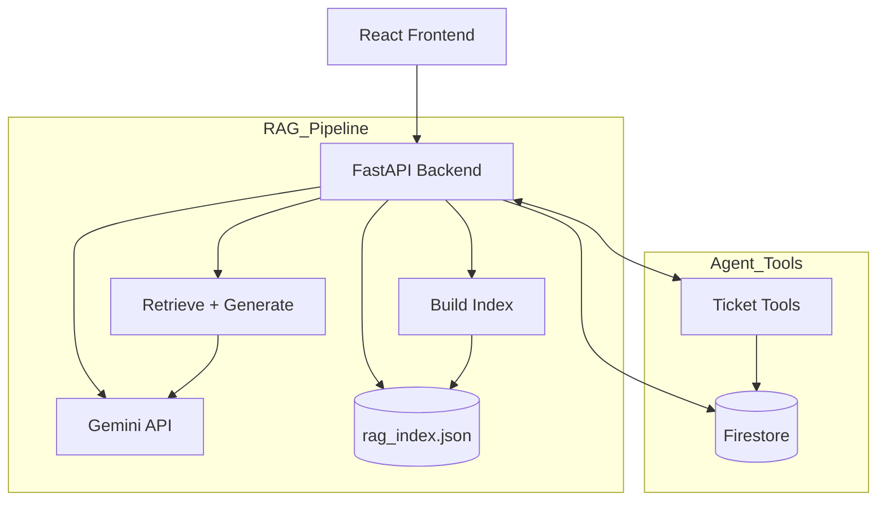

# Atlan Support Copilot (RAG + Tool-Enabled Agent)

> Production-style prototype: FastAPI + Firestore backend, embedding-based RAG at ticket creation, React (Vite) frontend, Gemini model for classification & agentic tooling.

---
## 1. Overview
This project implements an AI-assisted helpdesk where:
- Users create support tickets (subject + body + optional initial message).
- A background pipeline classifies each ticket (topic tags, sentiment, priority) and performs a **single-shot RAG pass** to generate an initial grounded agent reply (or routing message) **only at ticket creation**.
- A conversational **analytics agent** (separate from the RAG pipeline) can answer operational questions (e.g., "list P0 tickets" or "how many Negative sentiment tickets?") via Firestore-aware tool calls, *without* triggering additional RAG.
- Frontend displays ticket list, detail view, classification status (with graceful loading), conversation history, and sources (clickable) from the initial RAG answer.

Core goals achieved:
1. Deterministic, one-time RAG usage (controlled cost + consistency).
2. Tool-enabled agent for ticket analytics / exploration.
3. Robust classification & prompt normalization to avoid empty or ambiguous outputs.
4. Transparent diagnostics when tools return empty results or model output is missing.

---
## 2. Architecture Diagram


---
## 3. AI Pipelines
### 3.1 Classification
- **Model**: Gemini (configurable via `GEMINI_MODEL` env; default `gemini-2.5-flash`).
- **Prompt Strategy**: Strong, constrained JSON schema with enforced canonical values:
  - `priority`: `P0 (High)` | `P1 (Medium)` | `P2 (Low)`
  - `sentiment`: `Positive` | `Neutral` | `Negative`
  - `topic_tags`: 1–3 (or up to 5 in background task) with mandated inclusion of at least one RAG-relevant tag when instructional (e.g. `how-to`, `api/sdk`, `best practices`, `product`, `sso`).
- **Robustness**: Liberal extraction + fallback defaults; normalization for tag variants (`api`→`api/sdk`, `best-practice`→`best practices`).

### 3.2 RAG (Single-Shot at Ticket Creation)
- **Trigger**: Only once, after classification, if any topic tag intersects RAG set `{how-to, product, best practices, api/sdk, sso}`.
- **Index**: Lightweight in-memory vector list persisted as `backend/rag_index.json` (for fast rebuild and deploy portability). TTL/staleness tracked via timestamp.
- **Embeddings**: Generated via Gemini embedding endpoint.
- **Retrieval**: Cosine similarity top-k (typical k=5 configurable), context concatenated with safety size checks.
- **Answer Generation**: Grounded prompt summarizing context snippets → final answer with a `Sources:` block.
- **Failure Handling**: If no answer is generated, fallback to a deterministic routing message.

### 3.3 Conversational Analytics Agent
- **Separation of Concerns**: Does *not* invoke RAG. Only interacts with Firestore via controlled tools.
- **Tools**: `fetch_tickets`, `get_ticket`, `search_tickets`, `aggregate_tickets`, `update_ticket`, `delete_ticket`.
- **Normalization Layer**: Canonicalizes priority/sentiment filters (e.g. "p2" → `P2 (Low)`) and update payload classification.
- **Loop**: Up to 5 tool iterations; collects tool outputs; returns consolidated natural-language reply or diagnostics.

---
## 4. Design Decisions & Trade-offs
| Area | Decision | Rationale | Trade-off |
|------|----------|-----------|-----------|
| RAG Timing | One-shot at ticket creation | Stable cost, consistent first response, avoids mid-conversation hallucination | Not adaptive to later ticket edits (could add re-RAG trigger) |
| Storage | Firestore | Simple managed NoSQL + flexible document model | Limited ad-hoc text search (implemented naive substring fallback) |
| Vector Store | JSON file (`rag_index.json`) | Zero extra infra, fast startup for small corpus | Not scalable for large corpora; no ANN optimizations |
| Model | Gemini (single family) | Unified API for classify + embed + generate | Vendor lock; might tune per-task models later |
| Agent Tools | Narrow, explicit set | Reduces misuse, increases determinism | Less flexible for novel ops |
| Diagnostics | Friendly fallback messages | Aids debugging, transparency | Slight verbosity in edge cases |
| Normalization | Canonical filter & update args | Prevents empty results due to format mismatch | Requires maintenance if schema changes |

---
## 5. Setup & Local Development
### 5.1 Prerequisites
- Python 3.11+ (project tested with 3.13 locally)  
- Node.js 18+ (for frontend)  
- Firebase project + service account key (Firestore in Native mode)  
- Gemini API key

### 5.2 Environment Variables (`backend/.env`)
```
GEMINI_API_KEY=YOUR_KEY
FIREBASE_CREDENTIALS=./serviceAccountKey.json   # or path to your downloaded JSON
GEMINI_MODEL=gemini-2.5-flash                   # optional override
RAG_DEBUG=true                                  # optional verbose logs
```
Place your Firebase service account JSON inside `backend/` (or adjust path).

### 5.3 Firestore Indexes
Deploy provided composite indexes:
```powershell
firebase deploy --only firestore:indexes
```
(Indexes defined in `firestore.indexes.json`).

### 5.4 Backend Install & Run
```powershell
cd backend
pip install -r requirements.txt
# or: pip install fastapi "uvicorn[standard]" python-dotenv firebase-admin google-generativeai pydantic
uvicorn main:app --reload --port 8000
```
Health check: http://127.0.0.1:8000/health

### 5.5 Frontend Install & Run
```powershell
cd frontend
npm install
npm run dev
```
Dev UI (Vite default): http://127.0.0.1:5173

### 5.6 RAG Index Management
- Status: `GET /rag/status`
- Force rebuild: `POST /rag/rebuild`

### 5.7 Sample Ticket Creation
```powershell
Invoke-RestMethod -Method Post -Uri http://127.0.0.1:8000/create_ticket -Body (@{subject='Cannot connect to Snowflake'; body='Steps to configure connector?'; initial_message='Need help'} | ConvertTo-Json) -ContentType 'application/json'
```

### 5.8 Agent Query (Analytics)
```powershell
Invoke-RestMethod -Method Post -Uri http://127.0.0.1:8000/agent_query -Body (@{user_message='List P2 tickets'} | ConvertTo-Json) -ContentType 'application/json'
```

---
## 6. Deployment Guidance
You can mix & match hosting:
- **Backend**: Railway, Render, Fly.io, Google Cloud Run (containerize FastAPI).  
- **Frontend**: Vercel, Netlify, Cloudflare Pages (static + proxy to backend API).  
- **Secrets**: Configure `GEMINI_API_KEY` + base64 or file-mounted service account for Firestore.

Example Dockerfile snippet (not included by default):
```dockerfile
FROM python:3.12-slim
WORKDIR /app
COPY backend/requirements.txt .
RUN pip install --no-cache-dir -r requirements.txt
COPY backend/ .
ENV PORT=8000
CMD ["uvicorn", "main:app", "--host", "0.0.0.0", "--port", "8000"]
```

---
## 7. Measuring Answer Quality & System Evaluation
### 7.1 Classification
- Collect a labeled validation set of N tickets.
- Metrics: accuracy (priority), macro-F1 (sentiment), tag precision/recall (topic_tags).
- Evaluate drift monthly: flag if priority mismatch > X% vs baseline.

### 7.2 RAG Retrieval
- Maintain a relevance set (ticket → relevant doc IDs).
- Metrics: Recall@K, MRR@K, Coverage (% of RAG-eligible tickets that yield ≥1 relevant doc).

### 7.3 Generated Answer Quality (Initial RAG Response)
Human rubric (1–5):
1. Incorrect / hallucinated
2. Partial / missing key step
3. Mostly correct, minor gap
4. Complete and clear
5. Complete, clear, actionable, cites sources
Track average score; require ≥3.5 for production gating.

### 7.4 Agent Analytics Responses
Heuristics:
- Tool Efficiency: avg tool calls per query (<3 target)
- Empty Result Rate: % queries producing diagnostics instead of data (<10% target after normalization)
- Latency: P95 end-to-end < 2.5s (excluding cold start)

### 7.5 Operational Monitoring (Future)
- Log classification latency & failures.
- Log RAG index staleness and rebuild duration.
- Structured tool call logs (tool name, normalized args, duration, result size, error flag).

---
## 8. Maintainability & Engineering Decisions
| Aspect | Choice | Benefit |
|--------|--------|---------|
| Single model family | Gemini for classify/embed/generate | Simplifies ops & reduces integration overhead |
| Explicit tool schema | Function declarations | Predictable agent behavior, easier audit |
| Arg normalization layer | Centralized `_normalize_tool_args` | Minimizes silent empty results |
| JSON index persistence | Fast cold start, no external vector DB | Easier local dev / portability |
| Fallback diagnostics | Consistent messaging | Faster debugging & user trust |
| Separation (RAG vs Agent) | Clear lifecycle boundaries | Cost control & deterministic first answer |

---
## 9. Extensibility Roadmap
Short-term:
- Add automated evaluation script for classification/regression metrics.
- Switch RAG store to a scalable vector DB (e.g., Pinecone, Weaviate) behind an interface.
- Implement re-RAG trigger when ticket body updated significantly.
- Add auth & role-based access control (restrict delete/update tools).

Medium-term:
- Streaming responses for large analytical summaries.
- Multi-language classification with language detection.
- Rate limiting & usage quotas per user.

Long-term:
- Active learning loop (human corrections feed back into classifier few-shot examples).
- Feedback-weighted reranking for retrieval.

---
## 10. Limitations
- RAG corpus scope & ingestion pipeline not shown (assumes existing doc set already embedded).
- No production-grade auth, monitoring, or rate limiting included.
- Firestore substring search is naive (client-side scan) — consider dedicated search service if scale grows.
- Single model configuration; no fallback model tier.

---
## 11. Project Structure (Key)
```
backend/
  main.py              # FastAPI app, classification, agent, tool registry
  rag.py               # Embedding index build/load & RAG answer generation
  requirements.txt
  ...
frontend/
  src/                 # React components, hooks, API client
  ...
rag_index.json         # Persisted embedding index (generated)
firestore.indexes.json # Firestore composite indexes
firebase.json          # Firebase project config
```

---
## 12. Running Tests (Future Suggestion)
Add a `tests/` folder with:
- Unit: normalization, classification parsing, retrieval scoring helper.
- Integration: create ticket → confirm classification & first agent message; agent_query analytics flow.

---
## 13. Deployment URL & Repo
- Live App: https://atlan-copilot.vercel.app/
- Repository: https://github.com/RahilKothari9/atlan-copilot

---
## 14. Contributing
1. Fork
2. Branch: `feat/<name>`
3. PR with description of change & testing notes

---
## 15. License
Add a suitable license (e.g., MIT) before external distribution.

---
## 16. Quick Start (TL;DR)
```powershell
# Backend
cd backend
pip install -r requirements.txt
copy ..\your-service-account.json serviceAccountKey.json
uvicorn main:app --reload
# Frontend
cd ../frontend
npm install
npm run dev
```
Create tickets, inspect http://localhost:8000/docs for API swagger, and query the agent.

---
## 17. Accuracy Improvement Tips
- Maintain a small golden dataset; rerun weekly.
- Track drift in priority distribution (e.g., chi-square vs historical baseline).
- Introduce lightweight guardrails: verify each RAG answer cites ≥1 retrieved source; otherwise route.

---
## 18. Security Considerations (Future)
- Add API key auth or JWT in headers.
- Sanitize user input for logging (PII scrubbing if needed).
- Service account principle of least privilege.

---
**Enjoy exploring the Atlan AI Helpdesk!**
